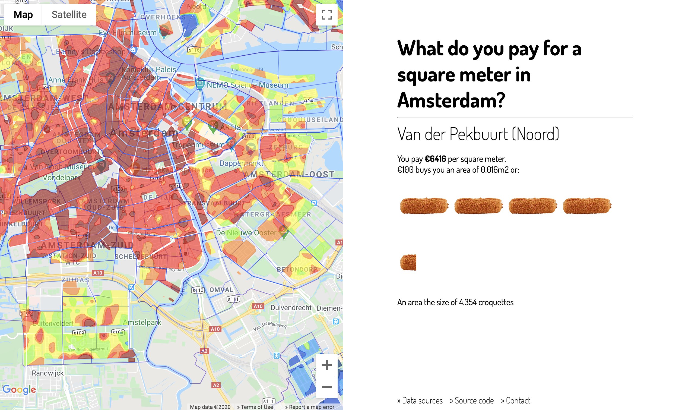

# Squaremeter.amsterdam

_"Wait, you paid what for that apartment the size of a post stamp?!"_ is for some a commenly heard phrase. But what does that all really mean? Square meters and and square meter prices can be too abstract in many cases. So what if we chance things around and look at what you really get for your hard-earned money? 

And since we all had a bitterball, stroopwafel, or tompouce at least once in our lifes it might be a good idea to relate it to those items.

## Screenshot

## Data sources
Big efforts have been made to get up-to-data and correct data sources. All data that is visualized in this web application on the website can be found in the [`./data`](https://github.com/SvanBoxel/squaremeter.amsterdam/tree/master/data) directory. Data is structured following the [GeoJSON format](https://geojson.org/) specification, or as raw JSON data. 

The original data sources are: 
- [Neighborhood geo data](https://claircitydata.cbs.nl/dataset/districts-and-neighbourhoods-amsterdam/resource/d02c5f12-1cfa-4d7c-91d3-41af8e4ed634)
- [City Areas](https://maps.amsterdam.nl/open_geodata/?k=202)
- [Square meter price data _(2018 data set)_](https://maps.amsterdam.nl/woningwaarde/?LANG=en)

Everything except for the price data can be re-retrieved and parsed from these sources by running the `./scripts/retrieve-data.js` script (`npm run retrieve-data`). Price data has been manually imported into this project.

## Attribution
Amsterdam Icon by _ProSymbols_ from [the Noun Project](https://thenounproject.com/search/?q=amsterdam&i=2247402)

## Contributions
In case you're thinking of improving this project, or adding support for other cities as well, then you can go ahead and open up a pull request or issue in this repository. 
